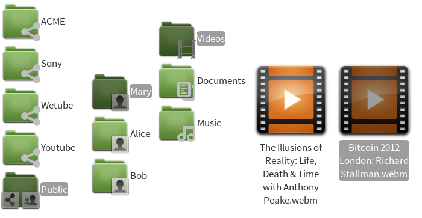
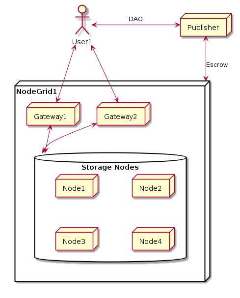

# Introduction

Bitcloud is a universal protocol aiming to provide a massive distributed filesystem, or "virtual
hark disk", capable of storing data encrypted and signed across all connected
nodes, protecting privacy and guarantying quality of service (QoS).

The easiest way to understand Bitcloud is thinking about it as a virtual
storage device, whose content is in fact in Internet in a distributed fashion, like this:

The first thing you notice is that the main "folders" are the
publishers. There are many private publishers, each one associated with normal
companies or Distributed Applications (DAs) like Wetube. There is also a
*Public grid*, in which everybody is free to publish without
censorship.

Bitcloud is *coin agnostic*, meaning that it only pretends to be the base for
the storage needs of future DAs. Bitcloud can use the escrow capabilities of
Bitcoin and/or the contracts of Ethereum. Bitcloud pretends to substitute the
way in which servers interconnect today and make much easier, secure and
private for users, publishers and DAs to share files, and will be the
*fundamental* base for the upcoming DAs.

Whether you're watching videos from YouTube or listening to music on
Soundcloud, you're getting all of your content through one centralized
source. That centralized source could decide to delete certain content or be
forced to delete controversial content by a local government. The core
principles behind decentralized applications built on top of Bitcloud are
decentralization, complete autonomy, open source, and the choice of anonymity.

For a technical overview, read
[bitcloud.org](https://github.com/wetube/bitcloud/blob/master/bitcloud.org).

# Overview

Bitcloud is a distributed cloud storage system and escrow agent based on
Tahoe-LAFS that allows publishers to negotiate prices with nodes for storing
encrypted data and sharing that data with others. The decentralized nature of
Bitcloud allows anyone to publish large amounts of data in a way that is free
from
[censorship, high costs, and proprietary software](https://github.com/wetube/bitcloud/wiki/Why-Do-We-Need-Bitcloud%3F).

Bitcloud can be the base for decentralized applications that require data
storage and bandwidth. Whether you're watching videos from YouTube or
listening to music on Soundcloud, you're getting all of your content through
one centralized source. That centralized source could decide to delete certain
content or be forced to delete controversial content by a local
government. The core principles behind decentralized applications built on top
of Bitcloud are decentralization, complete autonomy, open source, and the
choice of anonymity.

In addition to providing private storage grids for decentralized applications,
there is also a public grid in Bitcloud that can be used by anyone. This grid
is completely unmoderated.

The Bitcloud distributed cloud storage system involves four different people:
storage nodes, gatekeepers, publishers, and users.

I. Storage Nodes

Storage nodes are the nodes on the Bitcloud network that are actually storing
all the data. They get paid by publishers for storing the data and sharing it
to users. As long as they deliver the correct content to the user, they are
paid for their work. All of the data they store is encrypted, which means they
don't what they are storing. Storage nodes also only have a portion of the
entire file requested by a user.

II. Gateways

Gateways are basically storage nodes with a good reputations. When a user
requests a file, parts of the file are collected from many different storage
nodes. The gateway then puts those pieces together and checks to make sure
that the correct data is being sent to the user. If the gateway notices a
problem, it punishes the storage node who sent them the wrong data.

III. Publishers

Publishers are the people or decentralized applications who are sending data
into the node pool. They pay the storage nodes for storing all of their
content. They also have the final say on whether or not the correct data has
been sent to the user. Once the publisher confirms that the user has received
the correct data, the escrow payment can be released.

IV. Users

Users are just the people who are requesting specific data from the Bitcloud
node pool. For example, it could be someone watching a video on WeTube.

# Help Work With Us

We want to make the process of creating Bitcloud *extremely* open, allowing
anyone who wants to participate to share their opinion and help with the
project.

# Watch Us

Please subscribe to the "issues" section in GitHub to watch us and submit your
questions and ideas there.

# Contact Us

Contact us via Freenode at: #bitcloud for general talk and #bitcloud-dev for development talk.

Contact us via the Forum at: http://talk.bitcloudproject.org/

Contact us on Reddit at: /r/bitcloud (http://www.reddit.com/r/bitcloud/)
